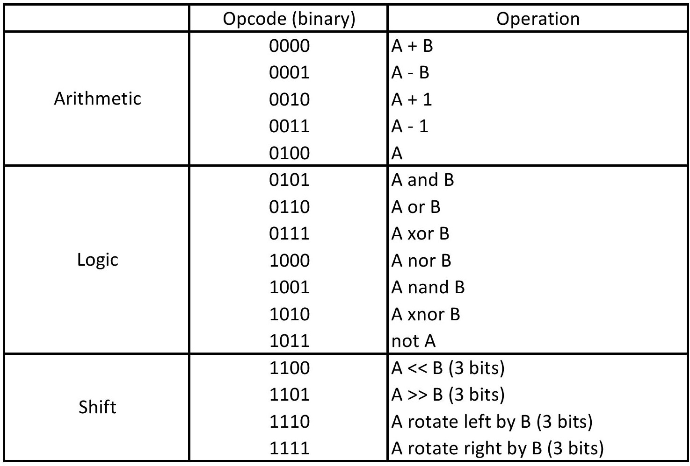

# Arithmetic Logic Unit

## Introduction
Arithmetic Logic Unit (ALU) is one of the most important digital logic components in CPUs. It normally executes logic and arithmetic operations such as addition, subtraction, multiplication, division, etc.
## Specifications
ALU is used to do the actual computation for the current instruction. This component is pure combinational. It has the following port. 
- ALU operand 1 port (8 bit, input, denoted as ALU.Operand1)
- ALU operand 2 port (8 bit, input, denoted as ALU.Operand2)
- ALU opcode port (4 bit, input, denoted as ALU.Opcode)
- ALU output port (8 bit, output, denoted as ALU.Out)
- ALU flags port (4 bit, output, denoted as ALU.Flags): the Z (zero), C (carry), S (sign), O (overflow) bits, from MSB to LSB

The opcode of ALU is listed in the following table.

